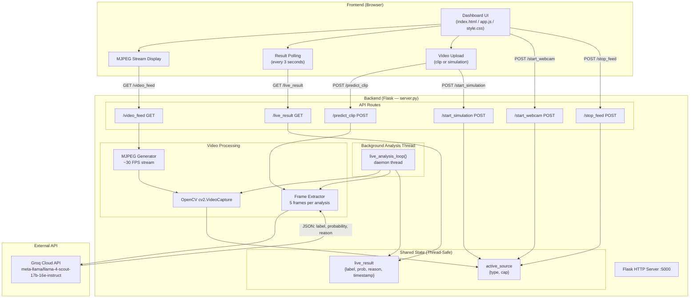
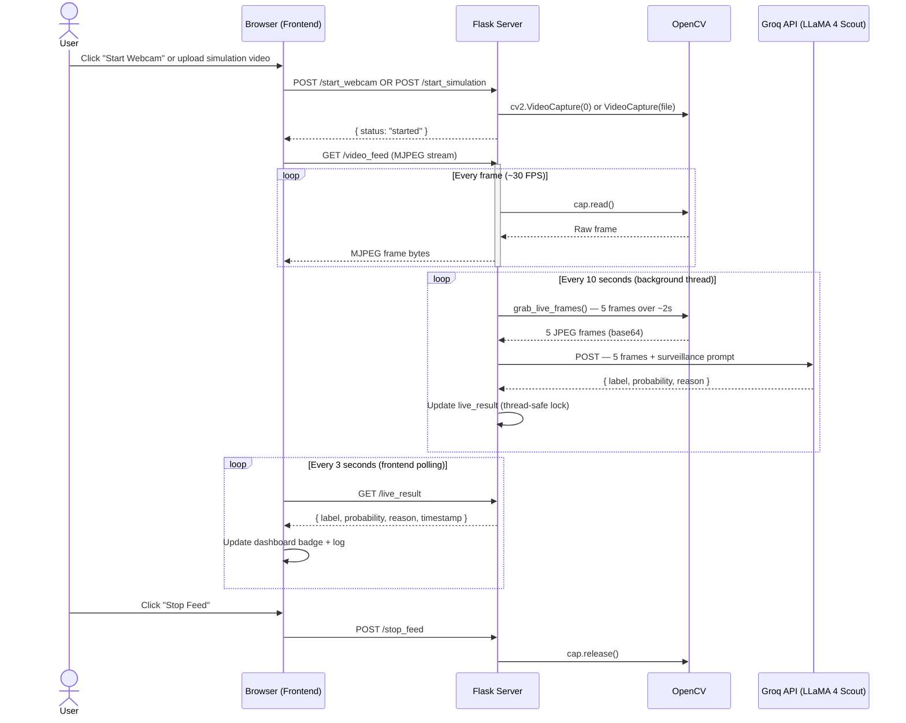
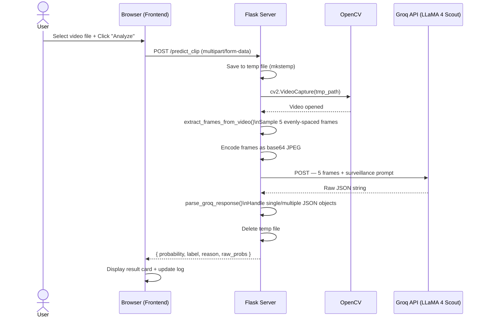
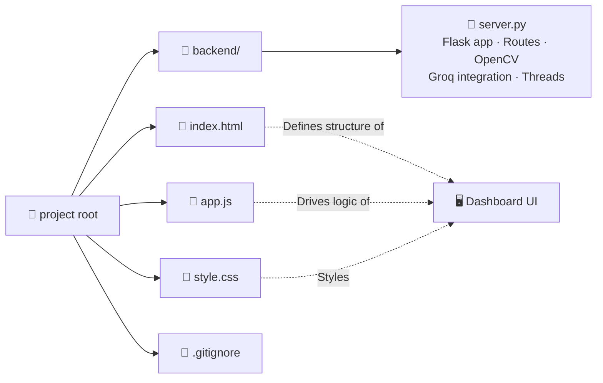
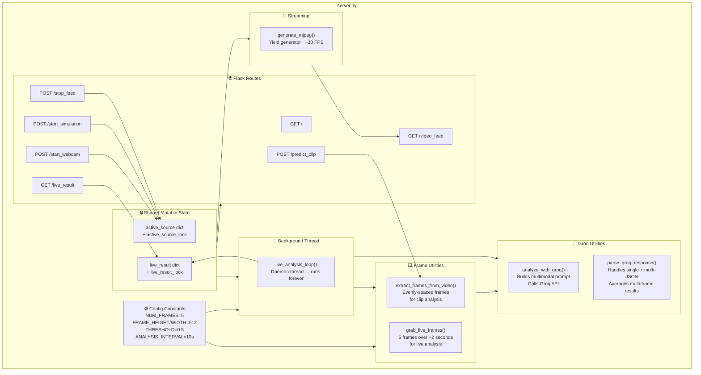
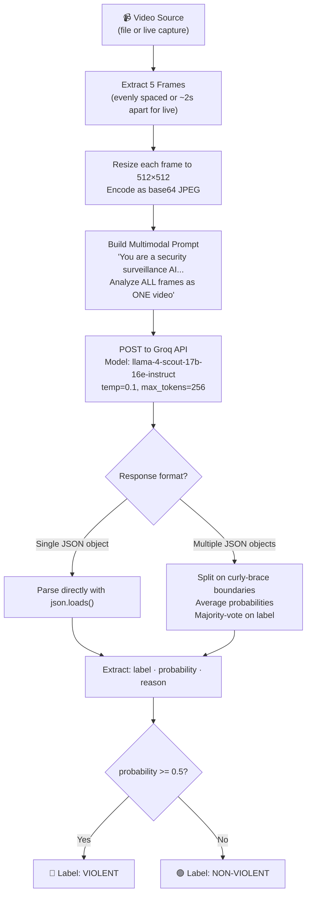
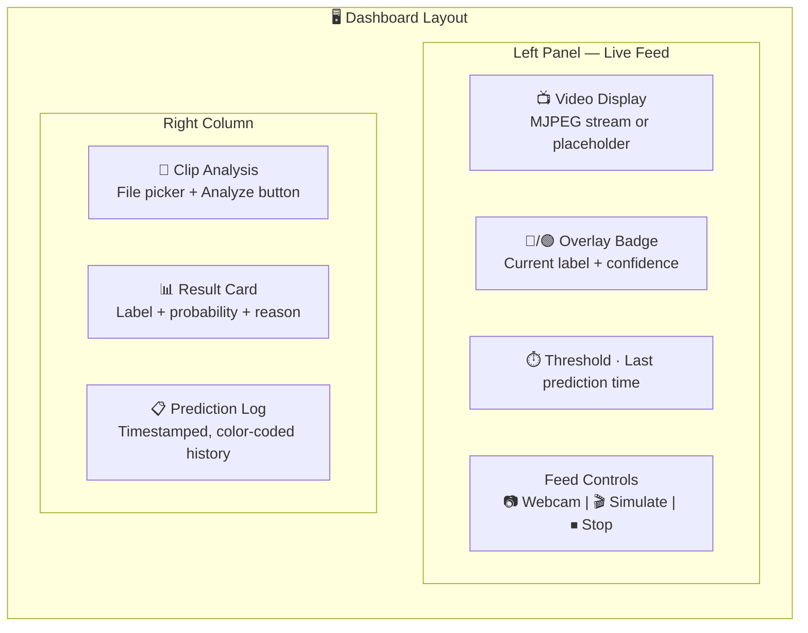
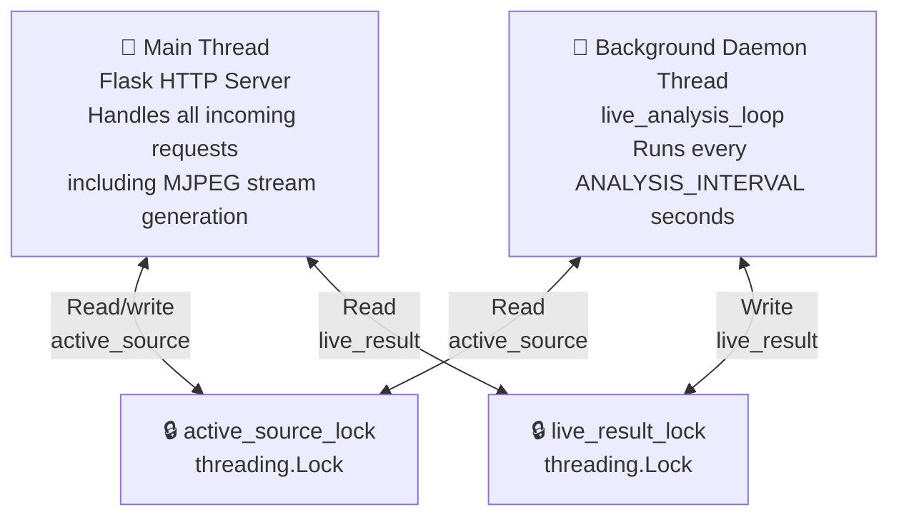

# 🔴 Mob Violence Detection System

> A real-time AI-powered CCTV surveillance dashboard that detects mob violence in video footage using computer vision and a multimodal large language model.

    

---

## Table of Contents

- [Overview](#overview)
- [Features](#features)
- [System Architecture](#system-architecture)
- [Data Flow](#data-flow)
- [Project Directory Structure](#project-directory-structure)
- [Component Breakdown](#component-breakdown)
- [API Reference](#api-reference)
- [Setup & Installation](#setup--installation)
- [Environment Variables](#environment-variables)
- [Configuration](#configuration)
- [How the AI Analysis Works](#how-the-ai-analysis-works)
- [Frontend Dashboard](#frontend-dashboard)
- [Threading Model](#threading-model)
- [Versioning Notes](#versioning-notes)

---

## Overview

This project is a web-based security surveillance tool that uses Groq's API (running **Meta LLaMA 4 Scout 17B**, a multimodal vision model) to analyze video footage and classify it as **violent** or **non-violent** in near-real-time.

It supports two operational modes:
1. **Live Feed Mode** — continuously analyzes frames from a webcam or simulated CCTV video every 10 seconds, streaming the video back to the browser as MJPEG.
2. **Clip Analysis Mode** — one-off upload and analysis of a single video file.

---

## Features

- 📷 **Webcam live feed** with real-time violence detection
- 🎬 **CCTV simulation** by uploading a pre-recorded video file
- 📁 **Single clip analysis** with detailed probability output
- 🧠 **Multimodal LLM reasoning** — the model explains *why* it flagged footage
- 📊 **Live dashboard** with prediction log, confidence score, and status badge
- 🔄 **Polling-based result delivery** (frontend polls every 3 seconds)
- 🔒 **Thread-safe state management** for concurrent video capture and analysis

---

## System Architecture



---

## Data Flow

### Live Feed Mode



### Clip Analysis Mode



---

## Project Directory Structure

```
MajorProjectmobViolence-main-main/
│
├── backend/
│   └── server.py          # Core Flask application
│                          #   - All API route handlers
│                          #   - OpenCV frame extraction
│                          #   - Groq API integration
│                          #   - Background analysis thread
│                          #   - MJPEG stream generator
│                          #   - Thread-safe shared state
│
├── index.html             # Single-page dashboard UI
│                          #   - Live camera feed panel
│                          #   - Clip upload/analyze panel
│                          #   - Prediction log panel
│
├── app.js                 # Frontend JavaScript
│                          #   - DOM bindings
│                          #   - API fetch calls
│                          #   - Live polling loop (3s interval)
│                          #   - Result rendering & log management
│
├── style.css              # Dashboard CSS
│                          #   - Dark surveillance aesthetic
│                          #   - Status badges & video overlays
│                          #   - Responsive two-column layout
│
└── .gitignore
```



---

## Component Breakdown



---

## API Reference

| Method | Endpoint | Description | Request Body | Response |
|--------|----------|-------------|--------------|----------|
| `GET` | `/` | Health check | — | `{ status, backend }` |
| `GET` | `/video_feed` | MJPEG video stream | — | `multipart/x-mixed-replace` stream |
| `POST` | `/start_webcam` | Start laptop webcam as live feed | — | `{ status }` |
| `POST` | `/start_simulation` | Upload video to simulate CCTV feed | `multipart: video` | `{ status, file }` |
| `POST` | `/stop_feed` | Stop the active live feed | — | `{ status }` |
| `GET` | `/live_result` | Get latest live analysis result | — | `{ label, probability, reason, timestamp }` |
| `POST` | `/predict_clip` | Analyze a single uploaded video clip | `multipart: video` | `{ label, probability, reason, raw_probs }` |

### Response Schemas

**`/live_result`**
```json
{
  "label": "violent",
  "probability": 0.87,
  "reason": "Multiple individuals appear to be striking each other near a crowd",
  "timestamp": "14:32:01"
}
```

**`/predict_clip`**
```json
{
  "label": "violent",
  "probability": 0.87,
  "reason": "Multiple individuals appear to be striking each other near a crowd",
  "raw_probs": {
    "violent": 0.87,
    "non_violent": 0.13
  }
}
```

---

## Setup & Installation

### Prerequisites

- Python 3.9+
- A [Groq API key](https://console.groq.com/)
- A webcam (optional, for live feed mode)

### Steps

```bash
# 1. Clone the repository
git clone https://github.com/your-username/mob-violence-detection.git
cd mob-violence-detection

# 2. Install Python dependencies
pip install flask flask-cors opencv-python numpy groq python-dotenv

# 3. Create your .env file
echo "GROQ_API_KEY=your_groq_api_key_here" > .env

# 4. Start the backend
python backend/server.py

# 5. Open the frontend
# Open index.html directly in your browser, or serve it with:
npx serve .
# Then visit http://localhost:3000
```

> **Note:** The frontend connects to `http://localhost:5000` by default. If you change the Flask port, update `API_BASE_URL` at the top of `app.js`.

---

## Environment Variables

| Variable | Required | Description |
|----------|----------|-------------|
| `GROQ_API_KEY` | ✅ Yes | Your Groq Cloud API key. Obtain one at [console.groq.com](https://console.groq.com) |

---

## Configuration

All tunable constants are defined at the top of `backend/server.py`:

| Constant | Default | Description |
|----------|---------|-------------|
| `NUM_FRAMES` | `5` | Number of frames extracted per analysis cycle |
| `FRAME_HEIGHT` | `512` | Frame resize height (pixels) before sending to Groq |
| `FRAME_WIDTH` | `512` | Frame resize width (pixels) before sending to Groq |
| `THRESHOLD` | `0.5` | Probability cutoff for classifying as `violent` |
| `ANALYSIS_INTERVAL` | `10` | Seconds between each background analysis in live mode |

---

## How the AI Analysis Works



The model is prompted to look for:
- Punching, kicking, or striking between individuals
- Throwing objects at people
- Stampede or crush dynamics in a crowd
- Aggressive mob formations with apparent intent

The model explicitly treats the following as **non-violent**:
- Normal crowd gatherings and queues
- People walking or standing in groups
- General movement without aggression

---

## Frontend Dashboard



The frontend is a **single-page vanilla JS application** with no framework or build step required. Key behaviors:

- Embeds the MJPEG stream as a plain `` tag — no WebRTC or WebSocket needed
- Polls `/live_result` every **3 seconds** and compares timestamps to avoid duplicate log entries
- Dynamically updates the colored status badge overlaid on the video panel
- Maintains a scrollable, prepended prediction history log with green/red color coding

---

## Threading Model



Both threads share two mutable objects, each protected by a `threading.Lock`:

- **`active_source`** — holds the current `cv2.VideoCapture` object and a string indicating source type (`"webcam"` or `"simulation"`)
- **`live_result`** — holds the latest classification result dict served to the polling frontend

The background thread is started as a **daemon thread**, so it automatically exits when the Flask process terminates — no manual cleanup required.

---

## Versioning Notes

`server.py` contains two versions of the backend logic:

| Version | Status | Features |
|---------|--------|----------|
| **v1** (fully commented out at top of file) | Legacy | Single clip analysis via `/predict_clip` only |
| **v2** (active, below the comments) | Current | v1 + live webcam feed, MJPEG streaming, background analysis thread, CCTV simulation mode |

The v1 code is intentionally preserved in comments as a reference baseline, making the evolution of the system easy to trace.

---

## License

MIT © 2024
